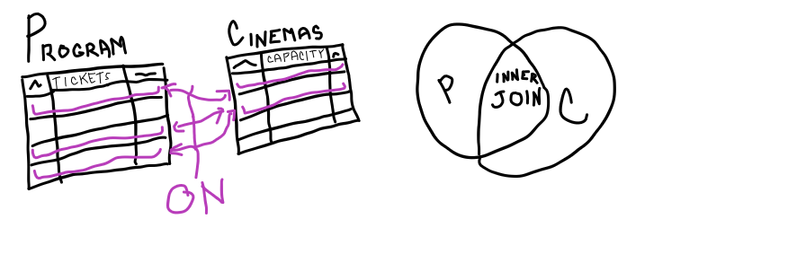
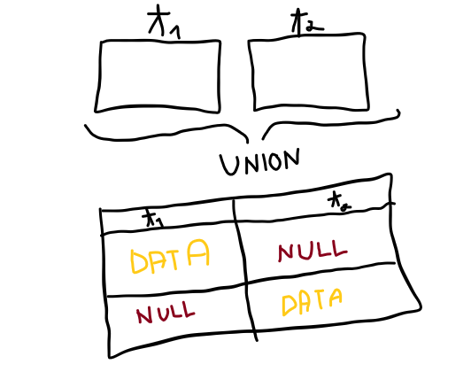

### Ako funguje ```INNER JOIN``` ?
- INNER JOIN priraďuje každý riadok v jednej tabuľke ku každému
riadku v druhej tabuľke a umožňuje dotazovať riadky, ktoré obsahujú 
stĺpce z oboch tabuliek

- píšeme ho hneď za ```FROM``` 

- za tabuľkami v ```INNER JOIN```E následuje podmienka ```ON```, ktorá 
špecifikuje ktoré riadky sa majú spojiť (do výslednej tabuľky sú zahrnuté len tie
riadky, ktoré spĺňajú podmienku)

- umožňuje oddeliť príkazy na výber dát od príkazov na spájanie tabuliek



```sql
-- Vypíšte zoznam všetkých premietaní, keď bolo kino vypredané.
-- Strieďte výsledok podľa mena kina a ďalej podľa dátumu premietania
select Program.*
from Program
inner join Cinemas
on Cinemas.Capacity = Program.Tickets
order by Program.Name, Program.Day
```

### Ako funguje ```NATURAL JOIN``` ?

_TODO : zisti ako sa dá natural join použiť v Microsoft SQL server management studiu_
- spája tabuľky podľa stĺpcov s rovnakým menom a typom

- netreba špecifikovať mená stĺpcov, podľa ktorých spájame tabuľky

- výsledná tabuľka neobsahuje žiadny stĺpec viackrát

### Ako funguje ```UNION JOIN``` ?

_TODO : zisti, ako sa dá union join použiť v Microsoft SQL server management studiu_

- z vysvetlenia Kopeckého by to malo zrejme vyzerať nejako takto :


### Ako funguje ```OUTER JOIN``` ?

- v prípade ```INNER JOIN``` pokiaľ sa k riadku v prvej tabuľke nenájde ani jeden 
riadok z druhej tabuľky, tak sa tento riadok vo výsledku nevyskytuje

- ```LEFT OUTER JOIN``` každý riadok v ľavej tabuľke je vždy vo výsledku a pokiaľ sú k nemu k dispozícii riadky z ostatných tabuliek, tak sú uvedené vo výsledku, ináč sú
všade, kde sa nepodarilo priradiť riadok null hodnoty

- ```RIGHT | FULL OUTER JOIN``` analogicky