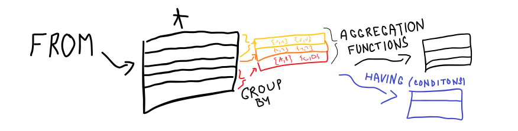

[Časť prednášky od 18:30 do 26:00](https://tirpitz.ms.mff.cuni.cz/contactless/lecture03b_CZ_web.mp4)
### Ako funguje ```GROUP BY``` ?

- dotazujem nad tabuľkou pomocou select

- potom zlúčim výsledky podľa niektorého stĺpca, čo mi potenciálne
môže vytvoriť multimnožiny (multi -> môžu obsahovať opakujúce sa prvky)

- k týmto množinám nemôžem pristupovať priamo, potrebujem agregačnú funkciu
    - napríklad : ```MIN```, ```COUNT```, ```MAX``` , ```AVG```, ```SUM```
  - ```COUNT(column_name)``` nezarátava NULL hodnoty
      - ```COUNT``` má možnosť rátania ```distinct``` 
    
- prípadne takúto tabuľku s množinami môžem dotazovať pomocou ```HAVING```



- ```group by``` je možné aj s viacerými argumentami