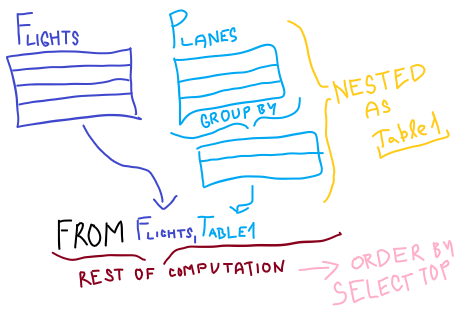

[Časť prednášky od 26:00 do konca](https://tirpitz.ms.mff.cuni.cz/contactless/lecture03b_CZ_web.mp4)

### Ako fungujú nested queries ?

- jednotlivé dotazy môžeme vnárať do seba

```sql
-- vráť spoločnosť, ktorá má najväčší súčet pasažierov a lietadlových kapacít
select top(1) Flights.Company, 
	min(Table1.TotalCapacity) as TotalCapacity, 
	sum(Flights.Passengers) as TotalPassengers
from Flights, (select sum(Capacity) as TotalCapacity, Company
				from Planes
				group by Company) as Table1
where Table1.Company = Flights.Company
group by Flights.Company
order by TotalCapacity desc
```

- vnárať sa môžem v ```FROM``` aj v ```JOIN```och a v ich podmienkach
- keď sa vnáram, potrebujem upozorniť ```MS SQL Server Manager```, že chcem pracovať s tabuľkou vytvorenou vo vnorení
  - preto potrebujem kľúčové slovo ```AS```, ktoré premenuje výsledok vnorenia

### Ako funguje ```TOP``` ?

- syntax ```select top (k)```, vyberie ```k``` prvých výsledkov
- best practice : najprv použi ```order by```, ináč sa vyberie náhodných prvých ```k``` riadkov, čo je k hovnu



