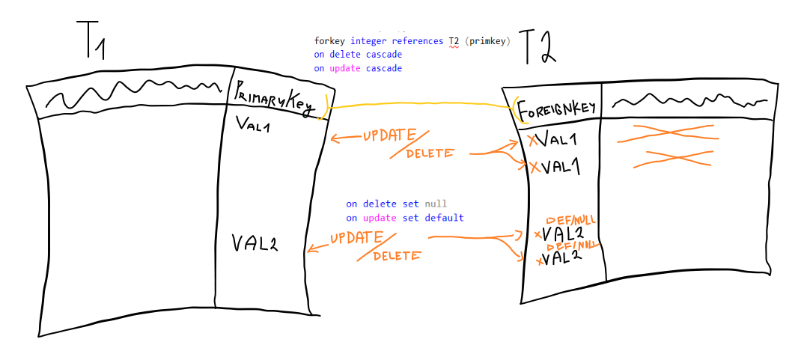

### Tvorenie tabuliek
---

__syntax :__
```sql
create table (
    column_name column_type [default _default_value] [constraint ...]
    ...
)
```
- ```column_type``` môže byť :
    - ```integer```
    - ```bit```
    - ```varchar(max_length)```
    - ```date```
    - ```numeric(precision, scale)``` 
    - ```decimal(precision, scale)```
    - ```float(precision)```
        - precision - počet číslic v stĺpci
        - scale - počet číslic za desatinnou čiarkou
        - rozdiel medzi ```decimal``` a ```numeric``` : v ```decimal``` je počet číslic
        v stĺpci >= ```precision``` v ```numeric``` platí rovnosť
- ```constraint``` 
    - pokiaľ sa obmedzenie nepomenuje (to sa deje tak, že sa constraint definuje priamo za definíciou stĺpca) tak je treba vyhľadať meno obmedzenia v definícii tabuľky v ```MS SQL Manager``` 
    - obmedzenia na hodnoty uložené v danom stĺpci
    - môže sa vzťahovať na celú n-ticu 
        - preto je syntax ```constraint constraint_name constraint_type (col1...)```
    - poznáme : ```UNIQUE```, ```NOT NULL```, ```REFERENCES``` (```FOREIGN KEY```), ```CHECK``` 
        - ```REFERENCES``` sa dá použiť len na jeden kľúč
        - ```FOREIGN KEY (column1, column2) REFERENCES table2(column1, column2)```
        - ```CHECK``` sa použije iba na novo pridané riadky (nie na riadky už uložené v tabuľke)


### Ako je definované správanie pri mazaní/aktualizovaní tabuľky, na ktorú je referencia ?

---

- pokiaľ sa aktualizuje/vymaže riadok, potrebujeme nejak aktualizovať všetky riadky, ktoré sa odkazujú na primárny kľúč v tomto riadku
- pomocou ```on delete```, ```on update``` vieme špecifikovať typ akcie, ktorá sa má vtedy udiať
  - ```cascade``` , ```set null```, ```set default```, ```no action```
  - pri použití ```no action```, ktoré je implicitné sa zabráni odstraňovaniu/aktualizovaniu v ```T1```




### Ako upravovať tabuľku ?

---

- používa sa príkaz ```ALTER TABLE``` 

__syntax :__

```sql
alter table table_name
	add constraint ...
	add column_name column_defs
	alter column column_name new_column_type
	alter 
	drop column column_name
	drop constraint constraint_name
```


### Mazanie tabuľky

---

- používa sa príkaz ```DROP TABLE```