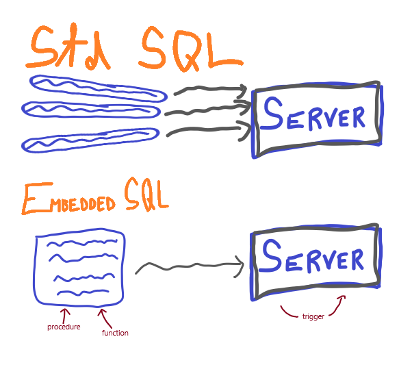

:movie_camera:[Link na prednášku](https://tirpitz.ms.mff.cuni.cz/contactless/lecture05_CZ_web.mp4)

# Embedded ```SQL```

- procedurálne rozšírenie ```SQL```

  - _MS SQL Server_ používa ```Transact SQL```

  - _Oracle_ používa ```PL/SQL``` 

  :heavy_plus_sign: umožňuje pridávať riadiace príkazy, premenné

  :heavy_plus_sign: znižuje záťaž sieťovej linky

:heavy_minus_sign: kvôli rôznym implementáciám to je __neprenosné__ rozšírenie




## Základná syntax

- #### Deklarácia premennej
  - ```DECLARE <var_name> <var_datatype> ``` - typy rovnaké ako v ```std SQL``` 
- ```<sql_statement```
- ```<statement_block>``` 
  
  - ```begin``` ... ```end``` 
- #### Procedúry
  - deklarácia : ```create procedure <procedure_name> [parameter_declarations[,..]] as <commands>```
  - používajú sa [riadiace príkazy]
  - volanie procedúry
    - príkaz ```exec``` | ```execute```
    - syntax ``` exec <procedure_name> [expression [,..]]```
- #### Funkcie
  - deklarácia : ```create function <function_name> [parameter_declarations[,..]] returns <type_name> as <commands>``` 
  - používajú sa [riadiace príkazy]
  - volanie funkcie 
    - príkaz ```<schema_name>.<function_name>([expression [,..]])```
- #### Kurzory
  - pri ```select``` statementoch môžeme získať len 1 stĺpcovú hodnotu pre 1 premennú, preto sa v bežných procedúrach/funkciách používajú takéto ```select``` statementy
  - pokiaľ chceme iterovať cez viacero riadkov ```select``` statementu, používame ```cursor```
  - deklarácia : ```<cursor_name> [scroll] cursor for select ..```
  - získanie dát z kurzora : ```fetch next from <cursor_name>``` - získa následujúci riadok zo ```select``` statementu, na ktorý ukazuje kurzor ```<cursor_name>```
  - pri špeciálnych ```scroll``` kurzoroch, môžeme iterovať aj v opačnom smere, prípadne môžeme pristupovať k premenným cez indexy - [ďalšie ```fetch``` možnosti](https://docs.microsoft.com/en-us/sql/t-sql/language-elements/fetch-transact-sql?view=sql-server-ver15#arguments)
  - zároveň sprístupňujú systémovú premennú ```@@fetch_status``` 
  - kurzor sa dá chápať analogicky k manipulácii so súbormi
    - príkazy ```close <cursor_name>``` a ```deallocate <cursor_name>```
- #### Trigerry
  - procedúry volané pri udalostiach
  - dovoľujú zaviesť zložitejšiu logiku kontroly dát v databáze
  - ```create trigger <trigger_name> on {<table_name> | <view_name>}```
  - poznáme 2 typy [```Data_manipulation_language```](https://docs.microsoft.com/en-us/sql/relational-databases/triggers/dml-triggers?view=sql-server-ver15) triggerov :
    - ```after``` trigger
    - ```instead of``` trigger
  - poznáme [```Data_definition_language```](https://docs.microsoft.com/en-us/sql/relational-databases/triggers/ddl-triggers?view=sql-server-ver15) triggery

